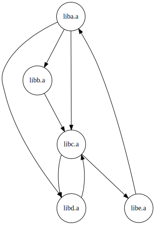

# static-lib-dep-tree

## how to install
```
# for avoiding 'pip Installing collected packages: UNKNOWN'
pip3 install setuptools --upgrade
pip3 install https://github.com/umaumax/static-lib-dep-tree/archive/master.tar.gz
```

```
# required library
pip3 install graphviz
```

## how to run
```
static-lib-dep-tree -o out.svg liba.a libb.a libc.a libd.a libe.a

static-lib-dep-tree -o out.svg liba.a libb.a libc.a libd.a libe.a liba.a

static-lib-dep-tree -o out.svg liba.a libb.a libc.a libd.a libe.a liba.a libc.a
static-lib-dep-tree -l -o out.svg liba.a libb.a libc.a libd.a libe.a
```

__you can use below python script to find circular reference__

* [misc\-scripts/dot\_find\_cycles\.py at master · jantman/misc\-scripts]( https://github.com/jantman/misc-scripts/blob/master/dot_find_cycles.py )
  * python3 script

```
$ static-lib-dep-tree -l -o out.dot liba.a libb.a libc.a libd.a libe.a
$ ./dot_find_cycles.py out.dot
['libe.a', 'liba.a', 'libd.a', 'libc.a']
['libe.a', 'liba.a', 'libc.a']
['libe.a', 'liba.a', 'libb.a', 'libc.a']
['libd.a', 'libc.a']
```

## figures
* `[x]` -> `[y]`: x depends y



## how to build static libs
```
for f in `ls *.cpp`; do g++ -std=c++11 $f -c -o ${f%.cpp}.o; ar r lib${f%.cpp}.a ${f%.cpp}.o; done

for f in `ls *.cpp`; do g++ -std=c++11 $f -c -o ${f%.cpp}.o; done

g++ -std=c++11 add.cpp -c -o add.o
ar r libadd.a add.o
g++ -std=c++11 sub.cpp -c -o sub.o
ar r libsub.a sub.o

ar r libabced.a a.o b.o c.o d.o e.o
```

## nm command output examples
```
# Max OS X
$ nm -A libadd.a
libadd.a:add.o: 0000000000000000 T __Z3addii
libadd.a:add.o:                  U __Z3subii
$ nm -A libsub.a
libsub.a:sub.o: 0000000000000000 T __Z3subii

# Ubuntu 16.04
$ nm -A libadd.a
libadd.a:add.o:0000000000000000 T __Z3addii
libadd.a:add.o:                 U __Z3subii
$ nm -A libsub.a
libsub.a:sub.o:0000000000000000 T __Z3subii
```

## FMI
### check list
* [x] .aの中の.oの依存関係による自己ループ
* [x] .aの中の.oの仕様の確認
* [x] .aから他の.aへの複数の依存エッジ
* [x] ループしてリンク先を検索した際に見つかる定義とそうでないものを分ける
  * 1.ループなしでlinkを行う
  * 2.ループありでlinkを行う(このときに，新規にlinkできたものに対してflagをONとし，これは，ループすれば見つかるシンボルを表す)
  * NOTE: 1.と2.は指定ライブラリをすべて一巡せずにその場で行っても問題ない(liba.a libb.a liba.aという重複パターンにおいても)
* [ ] 可視化したsvgを上から順番に見ていけば、依存関係の解決が可能だが，CUI的なoutputは?

### NOTE
* .oのリンク順番は関係あるが，.aのリンクの順番は関係ない

